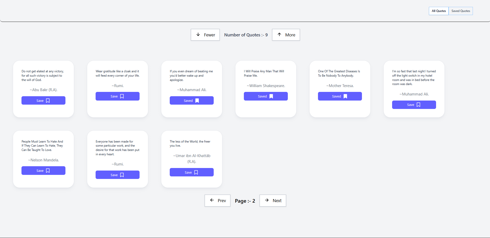
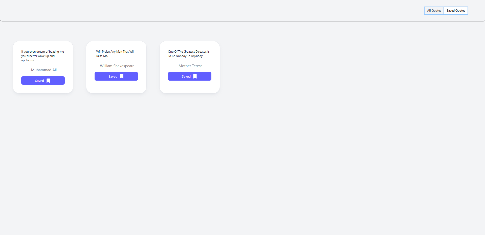

# ✨ Smart Quote Saver

A modern React application that fetches inspirational quotes from an external API and allows users to save their favorite quotes locally.

This project demonstrates practical React concepts including state management, conditional rendering, side effects, localStorage persistence, and UI state synchronization.

---

## 🚀 Features

- 🔄 Fetch quotes dynamically from API
- 📄 Pagination support (Next / Prev)
- 📊 Adjustable number of quotes per page
- 💾 Save / Unsave quotes
- 🧠 Saved quotes persisted using localStorage
- 🔁 Toggle between "All Quotes" and "Saved Quotes"
- ⏳ Loading state handling
- 🎨 Clean modern UI with responsive layout

---

## 🛠 Tech Stack

- React (Hooks)
- Axios
- Tailwind CSS
- React Icons (Remix Icons)
- localStorage (Browser API)

---

## 📸 Screenshots

### 🏠 Home – All Quotes



---

### 💾 Saved Quotes Section



---

## 🧠 Core Concepts Implemented

- useState for state management
- useEffect for side effects and API calls
- Derived UI from state
- Controlled view toggling
- Conditional rendering
- Local storage synchronization
- Component composition (Cards, Buttons)

---

## 📦 Installation

Clone the repository and run the project:

```bash
git clone https://github.com/your-username/smart-quote-saver.git
cd smart-quote-saver
npm install
npm run dev
```

---

## 📁 Project Structure

```bash
src/
│
├── components/
│   ├── Cards.jsx
│   ├── Buttons.jsx
│
├── App.jsx
├── main.jsx
├── index.css
```

---

## 📌 Author

Pratik Lachwani  

Built as part of continuous React learning and architectural practice.

---

⭐ If you like this project, consider giving it a star.